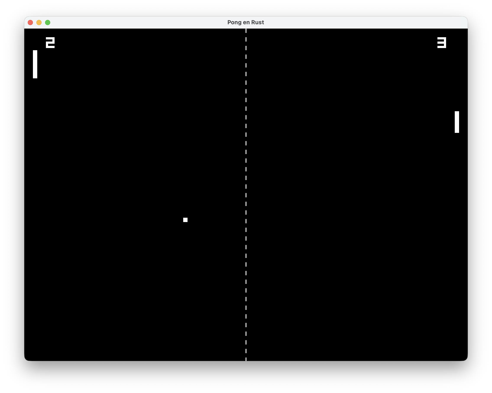

# Rust Pong

A simple Pong game implemented in Rust using the Piston game engine.



## Installation

To run the game, you need to have Rust installed on your system. You can install Rust using [rustup](https://rustup.rs/).

Once you have Rust installed, you can clone this repository and run the game:

```bash
git clone https://github.com/PiotrFLEURY/rust_pong.git
cd rust_pong
cargo run
```